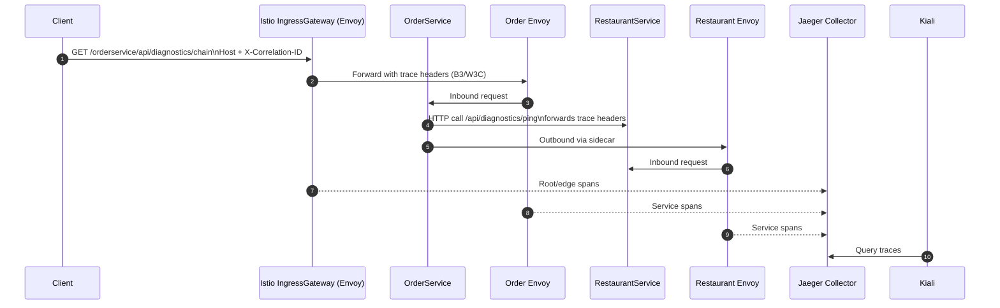
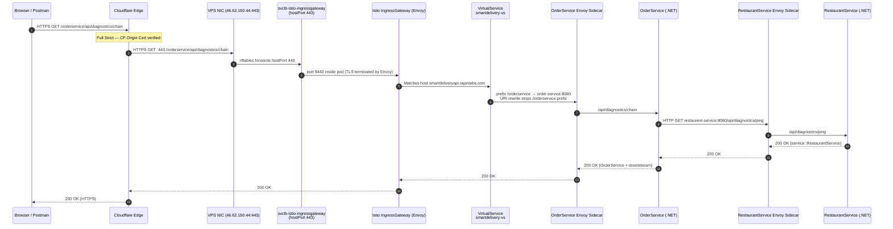

# SmartDelivery — Infrastructure Specification

> **Purpose:** Skill-showcase project. End-to-end microservices platform on a single self-hosted node.
> **Last verified:** 2026-03-17 | **Istio:** 1.25.2 | **k3s:** v1.33.3

---

## Table of Contents

1. [Cluster Overview](#1-cluster-overview)
2. [Namespace Layout](#2-namespace-layout)
3. [Resource Budget](#3-resource-budget)
4. [Istio Service Mesh](#4-istio-service-mesh)
5. [Observability Stack](#5-observability-stack)
6. [SmartDelivery Services](#6-smartdelivery-services)
7. [Traffic Routing](#7-traffic-routing)
8. [CI/CD Integration](#8-cicd-integration)
9. [Apply Order & Runbook](#9-apply-order--runbook)
10. [Known Limitations](#10-known-limitations)

---

## 1. Cluster Overview

| Property | Value |
|----------|-------|
| Provider | Self-hosted VPS (Hetzner / similar) |
| Orchestrator | k3s v1.33.3 |
| Topology | **Single node** — `sd-master` is both control-plane and worker |
| Node IP | `46.62.150.44` |
| CPU | 4 vCPU |
| RAM | 7.5 GiB |
| OS | Ubuntu 24.04.3 LTS |
| Container runtime | containerd 2.0.5-k3s2 |
| Total running pods | ~28 |

### Why single-node?

This is a showcase project. No HA, no autoscaling beyond HPA (defined but not exercised). The goal is demonstrating the full stack (service mesh, distributed tracing, structured logging, CI/CD) within a tight resource budget.

---

## 2. Namespace Layout

| Namespace | Purpose | Istio injection |
|-----------|---------|----------------|
| `smartdelivery` | All five application services | ✅ enabled |
| `istio-system` | Istio control plane + all addons (Jaeger, Kiali, Prometheus, Grafana) | ❌ (system) |
| `logging` | Elasticsearch + Kibana | ❌ |
| `kube-system` | Headlamp cluster dashboard | ❌ |
| `cert-manager` | TLS certificate management | ❌ |
| `default` | Contains a mesh-wide `Telemetry` resource only | ✅ enabled |

> **Note:** The `monitoring` namespace (separate Prometheus + Grafana Helm install) was removed on 2026-03-07 to reclaim ~546 MiB RAM. Cluster-level dashboards are now served by **Headlamp** (NodePort 30900, ~80 MiB) and optionally **Lens** (desktop app, zero cluster footprint).

---

## 3. Resource Budget

### Current actual usage (kubectl top)

| Namespace | Component | CPU | Memory |
|-----------|-----------|-----|--------|
| `istio-system` | prometheus | 54m | 477 MiB |
| `istio-system` | grafana | 7m | 161 MiB |
| `istio-system` | istiod | 6m | 105 MiB |
| `istio-system` | kiali | 7m | 69 MiB |
| `istio-system` | ingressgateway | 5m | 43 MiB |
| `istio-system` | egressgateway | 4m | 42 MiB |
| `istio-system` | jaeger | 11m | 42 MiB |
| `logging` | elasticsearch | 8m | **1156 MiB** |
| `logging` | kibana | 52m | 583 MiB |
| `kube-system` | headlamp | ~5m | ~80 MiB |
| `kube-system` | **kube-state-metrics** *(added 2026-03-21)* | 10m | ~35 MiB |
| `kube-system` | **node-exporter** *(added 2026-03-21)* | 10m | ~25 MiB |
| `smartdelivery` | 5 services (12 pods — HPA scaled) | ~51m | ~597 MiB |
| `smartdelivery` | 12 Envoy sidecars | ~15m | ~165 MiB |
| **Node total** | | **451m (11%)** | **5797 MiB (75%)** |

### Headroom for remaining two services

Each new .NET service + Istio sidecar ≈ 115 MiB / 15m CPU.
Two services = **~230 MiB** — fits within the ~2.1 GiB free.

---

## 4. Istio Service Mesh

### Installation

Installed via **Helm** using the official `istio/*` charts.

```bash
# Reproduce the install (values files are in Smart/)
helm install istio-base istio/base -n istio-system
helm install istiod istio/istiod -n istio-system -f Smart/istiod-values.yaml
helm install istio-ingressgateway istio/gateway -n istio-system -f Smart/gateway-values.yaml
```

### Version

`1.25.2` — verified via pod label `helm.sh/chart=istiod-1.25.2`.

### meshConfig (live — from `kubectl get configmap istio -n istio-system`)

```yaml
accessLogFile: /dev/stdout
enablePrometheusMerge: true
defaultConfig:
  tracing:
    sampling: 100          # 100 % sampling globally
defaultProviders:
  metrics: [prometheus]
  tracing: [jaeger]        # All namespaces default to jaeger tracing
extensionProviders:
- name: jaeger
  opentelemetry:
    port: 4317             # OTLP port on jaeger-collector
    service: jaeger-collector.istio-system.svc.cluster.local
```

> `Smart/istiod-values.yaml` reflects this config. Keep it in sync before any `helm upgrade`.

### Sidecar injection

`smartdelivery` namespace has `istio-injection=enabled` label.
All five service pods show `2/2 READY` (app container + Envoy proxy).

### mTLS

No `PeerAuthentication` or `AuthorizationPolicy` resources exist — the mesh runs in **permissive mode** (mTLS opportunistic). Acceptable for a showcase; enforce with `STRICT` mode before any production use.

---

## 5. Observability Stack

### 5.1 Structured Logging — Elasticsearch + Kibana

| Component | Namespace | Access |
|-----------|-----------|--------|
| Elasticsearch | `logging` | `http://elasticsearch.logging.svc.cluster.local:9200` (in-cluster) |
| Kibana | `logging` | `http://46.62.150.44:30601` (NodePort) |

- Each service ships logs via `Serilog.Sinks.Elasticsearch`
- Index pattern: `{servicename}-logs-{yyyy.MM}` (e.g. `orderservice-logs-2025.08`)
- Logs are structured JSON enriched with `CorrelationId`, `MachineName`, `ProcessId`

### 5.2 Distributed Tracing — Istio + Jaeger

| Component | Namespace | Access |
|-----------|-----------|--------|
| Jaeger all-in-one | `istio-system` | `kubectl port-forward svc/tracing 16686 -n istio-system` |
| Collector endpoint | `istio-system` | `jaeger-collector.istio-system:4317` (OTLP, in-cluster) |

**How tracing works:**

```
Inbound request
    → Envoy sidecar (ingress)  creates root span, injects B3/W3C headers
    → .NET service              must FORWARD trace headers on outbound calls
    → Envoy sidecar (egress)   creates child span from forwarded headers
    → jaeger-collector:4317    receives all spans via OTLP
    → Jaeger UI (port 16686)   stitches spans into a distributed trace
```

**Header propagation** is handled by `IstioTracingHeadersPropagationHandler` in `SharedSvc`
(registered automatically via `AddServiceDefaults`). Add it to every typed `HttpClient` builder:

```csharp
services.AddHttpClient<IFooService, FooService>(...)
    .AddHttpMessageHandler<CorrelationIdDelegatingHandler>()
    .AddHttpMessageHandler<IstioTracingHeadersPropagationHandler>()
    ...
```

**Storage:** Jaeger uses **Badger (embedded, emptyDir)**. Traces are **ephemeral** — lost on pod restart.
Acceptable for showcase. For persistence, mount a PVC or switch to an external backend.

**Telemetry resource** (`release/istio-observability.yaml`) sets 100 % sampling for the
`smartdelivery` namespace explicitly, overriding the mesh-wide default if needed.

### 5.2.1 Verification snapshot (2026-03-17)

Validated from live cluster using `kubectl get/describe` and runtime checks:

- `OrderService -> RestaurantService` diagnostics chain returns `200 OK` with same `X-Correlation-ID`.
- Jaeger API is reachable and lists mesh services (`order-service.smartdelivery`, `restaurent-service.smartdelivery`, `istio-ingressgateway.istio-system`).
- Kiali API is reachable and reports Jaeger as connected external service.
- Kiali graph shows `order-service -> restaurent-service` traffic edge with HTTP `200` responses.
- ✅ **2026-03-17:** `https://smartdeliveryapi.rajanlabs.com/orderservice/api/diagnostics/chain` returns `200 OK` over Cloudflare Full Strict HTTPS (no port number). TLS terminated at Istio IngressGateway using Cloudflare Origin Certificate (`smartdeliveryapi-tls` secret in `istio-system`).

**Quick sequence (request + propagation path):**



> Note: direct `kubectl port-forward` to app service is useful for app-level correlation checks, but ingress-based path is required to include gateway spans.

### 5.3 Service Mesh Graph — Kiali

| Component | Namespace | Access |
|-----------|-----------|--------|
| Kiali | `istio-system` | `kubectl port-forward svc/kiali 20001 -n istio-system` |

Kiali reads from:
- **Prometheus** (`http://prometheus.istio-system:9090`) — for the service graph
- **Jaeger** (`http://tracing.istio-system:16686`) — for distributed traces
- **Istiod** — for mesh config validation

✅ `external_services.tracing.enabled: true` is verified in live `ConfigMap/kiali`.

### 5.4 Cluster Dashboard — Headlamp

| Component | Namespace | Access |
|-----------|-----------|--------|
| Headlamp | `kube-system` | `http://46.62.150.44:30900` (NodePort) |
| Lens (desktop) | n/a — local machine | via kubeconfig, zero cluster footprint |

The `monitoring` namespace (separate Prometheus + Grafana) was **removed on 2026-03-07** (~546 MiB reclaimed).

- **Headlamp** provides coloured per-pod CPU/memory panels, namespace overviews, and log tailing directly from the browser (~80 MiB in-cluster).
- **Lens** (install on Windows separately) offers full-featured CPU/memory graphs per pod with zero cluster resource cost.
- Envoy sidecar metrics are still scraped by the `istio-system` Prometheus (required by Kiali — untouched).

```bash
# Install Headlamp
helm repo add headlamp https://headlamp-k8s.github.io/headlamp/
helm repo update
helm install headlamp headlamp/headlamp -n kube-system -f Smart/headlamp-values.yaml
```

---

## 6. SmartDelivery Services

| Service | Image | Port | Database | Status |
|---------|-------|------|----------|--------|
| AuthService | `ghcr.io/.../authservice:latest` | 8080 | None (hardcoded) | ✅ Running |
| RestaurantService | `ghcr.io/.../restaurentservice:latest` | 8080 | Azure SQL | ✅ Running |
| OrderService | `ghcr.io/.../orderservice:latest` | 8080 | Azure SQL | ✅ Running |
| CartService | `ghcr.io/.../cartservice:latest` | 8080 | Azure SQL | ✅ Running |
| PaymentService | `ghcr.io/.../paymentservice:latest` | 8080 | None (mock) | ✅ Running |
| *(Service 6)* | TBD | 8080 | TBD | 🔲 Pending |
| *(Service 7)* | TBD | 8080 | TBD | 🔲 Pending |

All services:
- Use ClusterIP on port 8080
- Have HPA configured (min 1 / max 5, CPU 70% / memory 80%)
- Have Istio sidecar injected (2/2 pods)
- Ship logs to Elasticsearch

---

## 7. Traffic Routing

### Current ingress path (as of 2026-03-17)

```
Browser / API Client (HTTPS)
  → Cloudflare Edge (Full Strict SSL — CF Origin Cert at origin)
  → HTTPS port 443 → 46.62.150.44
  → svclb-istio-ingressgateway (hostPort 443 → pod port 443)
  → Istio IngressGateway (Envoy) — TLS termination with smartdeliveryapi-tls secret
  → Gateway: istio-public-gateway   matches Host: smartdeliveryapi.rajanlabs.com (HTTPS server)
  → VirtualService: smartdelivery-vs prefix-routes + URI rewrite
  → ClusterIP service port 8080
  → Envoy sidecar → .NET container
```

> Port 80 remains active (passes through svclb hostPort 80 → Istio Gateway HTTP server) for
> direct NodePort testing and Cloudflare health probes. The VirtualService is unchanged.

#### TLS certificate setup (one-time)

| Step | Action |
|------|--------|
| 1 | In Cloudflare dashboard: SSL/TLS → Origin Server → Create Certificate. Hostnames: `*.rajanlabs.com`, `rajanlabs.com`. Validity: 15 years. Download `origin-cert.pem` and `origin-key.pem`. |
| 2 | Copy both files to the VPS (e.g. pipe over SSH: `Get-Content origin-cert.pem -Raw \| ssh root@46.62.150.44 "cat > /home/user/origin-cert.pem"`), then: |
| | `kubectl create secret tls smartdeliveryapi-tls --cert=/home/theoneplusbot/origin-cert.pem --key=/home/theoneplusbot/origin-key.pem -n istio-system` |
| | ⚠️ Use the **absolute path** — `~` expands to `/root/` when running as root, but files land in the SSH user's home dir. |
| 3 | `kubectl apply -f istio-gateway-config.yaml` |
| 4 | `kubectl get gateways.networking.istio.io -n istio-system -o yaml` — verify both HTTP and HTTPS servers appear |
| 5 | In Cloudflare: SSL/TLS → Overview → set mode **Full (strict)**. Enable orange-cloud proxy on the DNS A record. |

> **Why Cloudflare Origin Certificate, not Let's Encrypt?**
> CF Origin Certs are trusted by Cloudflare for Full Strict, last 15 years, and require no renewal
> automation. Let's Encrypt HTTP-01 can work through CF proxy, but adds cert-manager DNS-01
> configuration complexity that isn't warranted here. The Origin Cert is the standard CF-native solution.

### Why Traefik is disabled

k3s bundles **Traefik** as its default ingress controller and deploys a `ServiceLB` (svclb) DaemonSet pod that claims `hostPort: 80` and `hostPort: 443` on the node. The k3s CNI installs nftables DNAT rules routing all inbound port 80 traffic to the Traefik svclb pod — before nginx or Istio IngressGateway can receive it.

Since this project uses **Istio as the sole ingress controller**, Traefik is redundant and conflicting. It was disabled by patching its service to `ClusterIP`, which removes the svclb pod and frees the hostPort:

```bash
kubectl patch svc traefik -n kube-system -p '{"spec": {"type": "ClusterIP"}}'
```

With Traefik's DNAT rule gone, `svclb-istio-ingressgateway` takes ownership of `hostPort: 80`, and all external port 80 traffic reaches Istio directly.

### Full request flow — Browser to OrderService



### Gateway resource

Defined in `istio-gateway-config.yaml`, applied in `istio-system`. Has **two servers**: HTTP on port 80 and HTTPS on port 443 (TLS SIMPLE, `credentialName: smartdeliveryapi-tls`).

> ⚠️ **k3s CRD ambiguity:** k3s ships both the Kubernetes Gateway API (`gateway.networking.k8s.io/v1`)
> and Istio's Gateway CRD (`networking.istio.io/v1`). The shorthand `kubectl get gateway -A` resolves
> to the k8s Gateway API and returns nothing, which is misleading.
> Always use the full resource name:
> ```bash
> kubectl get gateways.networking.istio.io -A
> ```

### VirtualService routes (`release/RestaurentService/smartdelivery-virtualservice.yaml`)

| Prefix | Backend service |
|--------|----------------|
| `/authservice` | `auth-service.smartdelivery:8080` |
| `/restaurentservice` | `restaurent-service.smartdelivery:8080` |
| `/orderservice` | `order-service.smartdelivery:8080` |
| `/cartservice` | `cart-service.smartdelivery:8080` |
| `/paymentservice` | `payment-service.smartdelivery:8080` |
| `/` (catch-all) | `restaurent-service.smartdelivery:8080` |

> Add new service routes to `smartdelivery-virtualservice.yaml` before deploying each new service.

### Testing from outside the cluster

```bash
# Public URL (Cloudflare HTTPS Full Strict — preferred)
curl https://smartdeliveryapi.rajanlabs.com/orderservice/api/diagnostics/chain

# Direct NodePort HTTP (bypasses Cloudflare, bypasses TLS — for local diagnostics)
curl -H "Host: smartdeliveryapi.rajanlabs.com" \
     http://46.62.150.44:30774/orderservice/api/diagnostics/chain

# From inside VPS on HTTP (bypasses Cloudflare — svclb hostPort 80)
curl -H "Host: smartdeliveryapi.rajanlabs.com" http://localhost/orderservice/api/diagnostics/chain

# Verify TLS cert without Cloudflare proxy (set DNS to grey-cloud temporarily)
curl -v --resolve smartdeliveryapi.rajanlabs.com:443:46.62.150.44 \
     https://smartdeliveryapi.rajanlabs.com/orderservice/api/diagnostics/chain
```

### Diagnostics chain check (for propagation)

```bash
# Full public path (Cloudflare → Istio → OrderService → RestaurantService)
curl -H "X-Correlation-ID: diag-test-001" \
     https://smartdeliveryapi.rajanlabs.com/orderservice/api/diagnostics/chain

# Direct service port-forward (app-level check only, no Istio spans)
curl -H "X-Correlation-ID: diag-test-001" \
     http://localhost:8080/api/diagnostics/chain
```

---

## 8. CI/CD Integration

See `docs/TECH_SPEC_CICD.md` for full pipeline details.

Summary:
- GitHub Actions builds Docker images on push to `feature/migration`
- Images pushed to `ghcr.io/PrakashRajanSakthivel/{service}:latest`
- Release workflow applies Kubernetes manifests from this repo via a self-hosted runner
- Kubeconfig stored as `GHA_KUBECONFIG` secret

---

## 9. Apply Order & Runbook

### First-time setup

```bash
# 1. Namespaces
kubectl apply -f release/namespace.yaml

# 2. Image pull secret
kubectl apply -f release/image-pull-secret.yaml

# 3. Istio Gateway (already exists — idempotent re-apply is safe)
kubectl apply -f istio-gateway-config.yaml
# Verify with full resource name (k3s has two Gateway CRDs):
kubectl get gateways.networking.istio.io -A

# 4. Observability (Kiali tracing + Telemetry sampling)
kubectl apply -f release/istio-observability.yaml
kubectl rollout restart deployment/kiali -n istio-system

# 5. Per-service (repeat for each)
kubectl apply -f release/{Service}/

# 6. VirtualService routes
kubectl apply -f release/RestaurentService/smartdelivery-virtualservice.yaml
```

### Ongoing: upgrade istiod config

```bash
helm upgrade istiod istio/istiod -n istio-system -f Smart/istiod-values.yaml
```

### Quick access (port-forward)

```bash
# Kiali service graph
kubectl port-forward svc/kiali 20001:20001 -n istio-system

# Jaeger trace UI
kubectl port-forward svc/tracing 16686:16686 -n istio-system

# Grafana (istio metrics — still available if needed)
kubectl port-forward svc/grafana 3000:3000 -n istio-system

# Headlamp cluster dashboard
# Already NodePort — http://46.62.150.44:30900

# Kibana (logs)
# Already NodePort — http://46.62.150.44:30601
```

---

## 10. Known Limitations

| # | Limitation | Impact | Acceptable for showcase? |
|---|-----------|--------|--------------------------|
| 1 | **Single node** — no HA, no node failover | Any restart = full downtime | ✅ Yes |
| 2 | **Jaeger uses emptyDir** — traces lost on pod restart | Trace history disappears after Jaeger restarts | ✅ Yes |
| 3 | **`monitoring` namespace removed** — no cluster-native metrics scraping beyond Kiali's Prometheus | Use Headlamp (NodePort 30900) or Lens desktop for pod/CPU dashboards | ✅ Resolved 2026-03-07 |
| 4 | **EXTERNAL-IP `<pending>`** on IngressGateway LoadBalancer | Use NodePort 30774 instead | ✅ Yes |
| 5 | **mTLS permissive mode** — no `PeerAuthentication` | Service-to-service traffic not enforced encrypted | ✅ Yes |
| 6 | **No Ingress DNS** — must use `Host:` header or `/etc/hosts` | Extra step for manual testing | ✅ Yes |
| 7 | **HPA max=5 replicas** but single node | Scale-out has no second node to schedule on | ✅ Yes |
| 8 | **Kiali `tracing.enabled: false`** in live cluster | Trace links missing in Kiali | ❌ **Fixed:** applied `release/istio-observability.yaml` + Kiali restarted |
| 9 | **`kubectl get gateway -A` shows nothing** (k3s CRD ambiguity) | Misleading — Gateway does exist (192d old) | ✅ Use `kubectl get gateways.networking.istio.io -A` |
| 10 | **`/orderservice/api/diagnostics/chain` via ingress returned 404 during latest verification** | Prevents clean end-to-end ingress trace demo for diagnostics endpoint | ⚠️ Investigate VirtualService rewrite/path behavior for this route |
