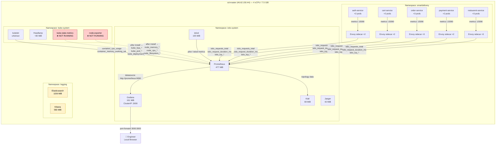
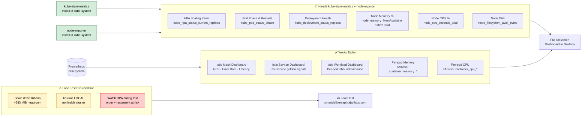
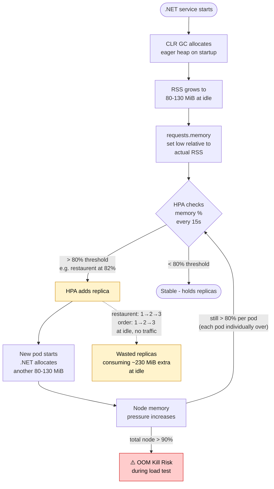

# SmartDelivery — Observability Architecture

> **Purpose:** Documents the actual (live-verified) observability stack, what metrics are available, what is missing, and the plan to close the gaps.
> **Last verified:** 2026-03-21 | **k3s:** v1.33.3 | **Istio:** 1.25.2

---

## Table of Contents

1. [Cluster State — Ground Truth](#1-cluster-state--ground-truth)
2. [Namespace & Component Map](#2-namespace--component-map)
3. [Prometheus — What It Actually Scrapes](#3-prometheus--what-it-actually-scrapes)
4. [Metric Coverage Matrix](#4-metric-coverage-matrix)
5. [Grafana — Deployed vs Repo State](#5-grafana--deployed-vs-repo-state)
6. [Current Utilization (Live Baseline)](#6-current-utilization-live-baseline)
7. [HPA Behaviour — The 80% Problem](#7-hpa-behaviour--the-80-problem)
8. [Gaps & Remediation Plan](#8-gaps--remediation-plan)
9. [Architecture Flowchart](#9-architecture-flowchart)

---

## 1. Cluster State — Ground Truth

| Property | Value |
|---|---|
| Node | `sd-master` (single node — control-plane + worker) |
| Node IP | `46.62.150.44` |
| CPU | 4 vCPU |
| RAM | 7.5 GiB |
| Orchestrator | k3s v1.33.3 |
| Container Runtime | containerd 2.0.5-k3s2 |
| Istio | 1.25.2 (Helm) |
| **Node CPU used** | **451m / 4000m (11%)** |
| **Node Memory used** | **5797 MiB / 7700 MiB (75%)** |

> ⚠️ Node is at 75% memory **at idle with no load** — this is the hard constraint for everything below.

---

## 2. Namespace & Component Map

| Namespace | Components | Istio Injection | Memory Footprint |
|---|---|---|---|
| `smartdelivery` | auth, cart, order, payment, restaurent services (each 2/2 with Envoy sidecar) | ✅ | ~597 MiB (apps) + ~165 MiB (sidecars) |
| `istio-system` | istiod, ingressgateway, egressgateway, Prometheus, Grafana, Kiali, Jaeger | ❌ | ~1067 MiB |
| `logging` | Elasticsearch, Kibana | ❌ | **~1739 MiB** ← largest consumer |
| `kube-system` | Headlamp, coredns, metrics-server, traefik (disabled), k3s agents | ❌ | ~200 MiB est. |
| `cert-manager` | cert-manager | ❌ | ~50 MiB est. |

> **Key deviation from INFRA_SPEC.md:** The `monitoring` namespace (separate kube-prometheus-stack) was removed on 2026-03-07 to reclaim ~546 MiB. This also removed **kube-state-metrics** and **node-exporter**, which are NOT currently running anywhere in the cluster.

---

## 3. Prometheus — What It Actually Scrapes

This is the **Istio-bundled Prometheus** (not kube-prometheus-stack). Its scrape config is in `ConfigMap/prometheus` in `istio-system` and uses pure Kubernetes service-discovery.

### Active Scrape Jobs (verified via `/api/v1/targets`)

| Job Name | Target | What it provides |
|---|---|---|
| `prometheus` | prometheus itself | Internal Prometheus health |
| `kubernetes-apiservers` | `sd-master:6443` | API server latency, request rates |
| `kubernetes-nodes` | `sd-master` (kubelet `/metrics`) | Kubelet internals |
| `kubernetes-nodes-cadvisor` | `sd-master` (kubelet `/metrics/cadvisor`) | **Container CPU & Memory** (cAdvisor) |
| `kubernetes-pods` | 20 pods auto-discovered from annotations | App + Istio sidecar metrics |
| `kubernetes-service-endpoints` | `kube-dns` only | DNS metrics |

### Pods Being Scraped (kubernetes-pods job)

| Namespace | Pods |
|---|---|
| `smartdelivery` | auth ×2, cart ×2, order ×3, payment ×2, restaurent ×3 |
| `istio-system` | istiod, ingressgateway, egressgateway, jaeger, kiali |
| `cert-manager` | cert-manager |
| `default` | sleep (test pod), webapp-deployment |

> **Important:** Prometheus scrapes these pods via the Envoy sidecar metrics endpoint (port `15090`) — this is how Istio L7 metrics (`istio_requests_total`, etc.) are collected. The app containers themselves do not expose `/metrics`.

---

## 4. Metric Coverage Matrix

This is the core finding. Verified by querying the live Prometheus instance.

### ✅ Available — Can Build Dashboard Panels Today

| Metric | Query Verified | Series Count | Use For |
|---|---|---|---|
| `istio_requests_total` | ✅ | 58 | RPS per service, error rate |
| `istio_request_duration_milliseconds_bucket` | ✅ | Present | P50/P95/P99 latency per service |
| `istio_request_bytes_*` | ✅ | Present | Request payload sizes |
| `istio_response_bytes_*` | ✅ | Present | Response payload sizes |
| `istio_tcp_connections_*` | ✅ | Present | TCP connection counts |
| `container_memory_working_set_bytes` | ✅ | **116 series** | Per-pod memory (cAdvisor) |
| `container_cpu_usage_seconds_total` | ✅ | **116 series** | Per-pod CPU (cAdvisor) |
| `kube_horizontalpodautoscaler_status_current_replicas` | ✅ label exists | **0 live results** | HPA scaling state |
| `kube_horizontalpodautoscaler_spec_max_replicas` | ✅ label exists | **0 live results** | HPA config |
| `kube_deployment_status_replicas_available` | ✅ label exists | **0 live results** | Deployment health |
| `kube_pod_container_status_restarts_total` | ✅ label exists | **0 live results** | Crash loop detection |

### ❌ Missing — Requires Additional Components

| Metric | Missing Because | Needed For | Fix |
|---|---|---|---|
| `kube_horizontalpodautoscaler_status_*` | **No kube-state-metrics pod** | HPA dashboard panels | Install kube-state-metrics |
| `kube_pod_info`, `kube_deployment_*` (live) | **No kube-state-metrics pod** | Pod phase, deployment health | Install kube-state-metrics |
| `node_memory_MemTotal_bytes` | **No node-exporter** (removed with monitoring ns) | Node-level memory % | Install node-exporter |
| `node_memory_MemAvailable_bytes` | **No node-exporter** | Node free memory | Install node-exporter |
| `node_cpu_seconds_total` (host) | **No node-exporter** | Node-level CPU % | Install node-exporter |
| `node_filesystem_avail_bytes` | **No node-exporter** | Disk usage | Install node-exporter |

> **Why do `kube_*` labels appear in Prometheus label catalog with 0 results?**
> The Prometheus TSDB still holds label index entries from when kube-state-metrics was running (before 2026-03-07). The labels show in `/api/v1/label/__name__/values` but return empty query results — they're stale catalog entries, not live data.

---

## 5. Grafana — Deployed vs Repo State

### Deviation Found

| | `Smart/grafana-values.yaml` (repo) | Live `ConfigMap/grafana` (cluster) |
|---|---|---|
| Prometheus datasource | `datasources: []` ← **empty** | `http://prometheus:9090` ✅ wired |
| Loki datasource | Not present | `http://loki:3100` (configured but Loki not deployed) |
| Service type | `NodePort` | `ClusterIP` ← **cluster differs** |
| Dashboards sidecar | `enabled: false` | Pre-provisioned via separate ConfigMaps |
| Admin password | `admin` | `admin` |

> **The values file in the repo does NOT reflect what's actually deployed.** The cluster was patched directly. The repo file needs to be updated to match truth (tracked in §8).

### Pre-provisioned Istio Dashboards (Already in Grafana)

These are in `ConfigMap/istio-grafana-dashboards` and `ConfigMap/istio-services-grafana-dashboards`:

| Dashboard | File | What it shows |
|---|---|---|
| Istio Mesh Dashboard | `istio-mesh-dashboard.json` | Global mesh RPS, error rate, latency |
| Istio Service Dashboard | `istio-service-dashboard.json` | Per-service golden signals |
| Istio Workload Dashboard | `istio-workload-dashboard.json` | Per-pod inbound/outbound metrics |
| Istio Performance Dashboard | `istio-performance-dashboard.json` | Control-plane CPU/memory |
| Pilot Dashboard | `pilot-dashboard.json` | istiod xDS push rates |
| Ztunnel Dashboard | `ztunnel-dashboard.json` | Ambient mesh (not in use) |
| Istio Extension Dashboard | `istio-extension-dashboard.json` | Wasm/extension metrics |

> All 7 dashboards are functional with the **Prometheus datasource** pointed at `http://prometheus:9090`. They cover Istio L7 metrics exclusively — no pod CPU/memory, no HPA, no node utilization.

---

## 6. Current Utilization (Live Baseline)

Captured via `kubectl top` and cAdvisor on 2026-03-21, no active load.

### Memory Hogs (Root Cause of 75% Node Usage)

| Component | Memory | Namespace | Notes |
|---|---|---|---|
| Elasticsearch | **1156 MiB** | `logging` | Largest single consumer |
| Kibana | **583 MiB** | `logging` | Worth scaling to 0 before load tests |
| Prometheus (Istio) | 477 MiB | `istio-system` | TSDB + scrape engine |
| Grafana | 161 MiB | `istio-system` | |
| All 5 app services | ~597 MiB total | `smartdelivery` | ~80-130 MiB per .NET pod |
| All 10 Envoy sidecars | ~165 MiB total | `smartdelivery` | ~33 MiB per sidecar |
| istiod | 105 MiB | `istio-system` | |
| Kibana + ES combined | **1739 MiB** | `logging` | **23% of total RAM** |

### Per-Service Memory from cAdvisor (Live)

| Service | Pod | Memory (MiB) | HPA Threshold |
|---|---|---|---|
| auth-service | pod 1 | 69 | 80% / limit |
| auth-service | pod 2 | 79 | 80% / limit |
| cart-service | pod 1 | 80 | 80% / limit |
| cart-service | pod 2 | 76 | 80% / limit |
| order-service | pod 1 | 123 | ⚠️ |
| order-service | pod 2 | 107 | ⚠️ |
| order-service | pod 3 | 57 | 80% / limit — already at 3 replicas |
| payment-service | pod 1 | 83 | 80% / limit |
| payment-service | pod 2 | 82 | 80% / limit |
| restaurent-service | pod 1 | 114 | 🔴 |
| restaurent-service | pod 2 | 130 | 🔴 |
| restaurent-service | pod 3 | 66 | 80% / limit — **already breached** |

---

## 7. HPA Behaviour — The 80% Problem

### Live HPA Status

```
NAME                   TARGETS                      MIN  MAX  REPLICAS
auth-service-hpa       cpu:3%/70%,  memory:64%/80%   1    5       2
cart-service-hpa       cpu:4%/70%,  memory:67%/80%   1    5       2
order-service-hpa      cpu:4%/70%,  memory:78%/80%   1    5       3   ⚠️
payment-service-hpa    cpu:4%/70%,  memory:70%/80%   1    5       2
restaurent-service-hpa cpu:4%/70%,  memory:82%/80%   1    5       3   🔴
```

### Why Services Are Scaling Without Any Traffic

This is a **fundamental .NET + HPA memory behaviour issue**:

1. **.NET CLR allocates eagerly** — the GC reserves heap on startup and does not release it back to the OS readily, even when idle. This is normal .NET behaviour.
2. The HPA memory threshold of **80%** is hit at idle because the `requests.memory` limit appears to be set lower than the .NET runtime's natural RSS footprint.
3. When HPA fires → adds a replica → that replica also has .NET startup memory → adds to node memory pressure → a cascading pressure loop is possible.

### Impact on Load Testing

Running k6 load will **not cause more HPA scale-up from CPU** (CPU is 3-4% at idle, headroom is huge). But it will raise **in-flight request buffers and HTTP connection pools**, potentially pushing memory over the threshold and triggering more replicas on an already memory-tight node.

> **Risk:** node OOM if restaurent-service or order-service scale from 3 → 4 replicas during load, adding ~115 MiB each while Elasticsearch already holds 1156 MiB.

---

## 8. Gaps & Remediation Plan

### Gap 1 — kube-state-metrics (missing)

**Impact:** No live data for HPA panels, deployment status, pod phase, restart counts in dashboards.

**Fix:** Install lightweight kube-state-metrics into `kube-system`. It uses ~25–35 MiB.

```powershell
helm repo add prometheus-community https://prometheus-community.github.io/helm-charts
helm install kube-state-metrics prometheus-community/kube-state-metrics `
  -n kube-system `
  --set resources.requests.memory=32Mi `
  --set resources.limits.memory=64Mi `
  --set resources.requests.cpu=10m `
  --set resources.limits.cpu=50m
```

Prometheus auto-discovers it via `kubernetes-pods` scrape job — no Prometheus config changes needed.

### Gap 2 — node-exporter (missing)

**Impact:** No node-level CPU %, memory %, disk %, network throughput.

**Fix:** Install prometheus-node-exporter as DaemonSet into `kube-system`. It uses ~20–25 MiB.

```powershell
helm install node-exporter prometheus-community/prometheus-node-exporter `
  -n kube-system `
  --set resources.requests.memory=20Mi `
  --set resources.limits.memory=32Mi `
  --set resources.requests.cpu=10m `
  --set resources.limits.cpu=50m
```

### Gap 3 — grafana-values.yaml repo drift

**Impact:** Running `helm upgrade grafana` from the repo file would **wipe the datasource** configuration and revert the service type.

**Fix:** Update `Smart/grafana-values.yaml` to match the live cluster state (datasource, service type).

### Gap 4 — HPA memory threshold too aggressive for .NET

**Impact:** Services scale unnecessarily from 1→2→3 replicas at idle, consuming extra node memory.

**Fix (considered):** Either raise `averageUtilization` for memory from 80% → 95%, or increase `resources.requests.memory` in deployment manifests to match actual .NET RSS so the utilization % reads correctly. Requires testing.

### Gap 5 — Load test safety — Kibana should be scaled down

**Impact:** Kibana uses 583 MiB. Keeping it running during a load test risks OOM.

**Fix (before every load test):**
```powershell
kubectl scale deployment kibana -n logging --replicas=0  # free ~583 MiB
# run load test
kubectl scale deployment kibana -n logging --replicas=1  # restore
```

### Ordered Action Plan

| Order | Action | Memory delta | Priority |
|---|---|---|---|
| 1 | `kubectl port-forward` Grafana — see existing dashboards | 0 | Now |
| 2 | Install kube-state-metrics | +35 MiB | High |
| 3 | Install node-exporter | +25 MiB | High |
| 4 | Fix `Smart/grafana-values.yaml` to match cluster truth | 0 | Medium |
| 5 | Build utilization dashboard in Grafana | 0 | Medium |
| 6 | Scale down Kibana before load test | −583 MiB | Required pre load-test |
| 7 | Run k6 load test from local machine | 0 (cluster) | After above |

---

## 9. Architecture Flowchart

### Metric Collection Flow (Current State)



### Dashboard Capability Map (Current vs After Fix)



### HPA Memory Scaling Problem (Root Cause)


